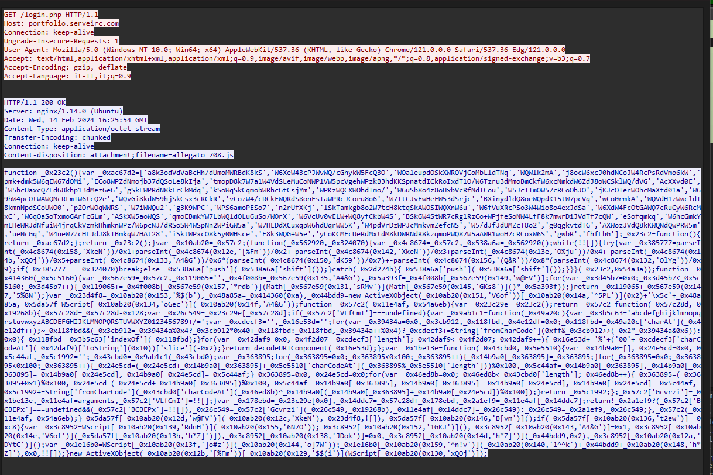

**Infraestructura / Contexto:**
- Muestra extraída del PCAP: `login.php`
- IP atacante: `62.173.142.148`
- Entorno de análisis: VM aislada (sin internet), herramientas `grep`, `js-beautify`

---

## 🔎 Vector de Entrada
El archivo `login.php` servía código **JavaScript ofuscado** en lugar de contenido legítimo.  
Este JS actuaba como **dropper inicial**.



---

## 🧩 Mecanismo de Ofuscación

- Define una **tabla de strings** `_0xac67d2`.  
- Utiliza una función `_0x57c2(offset, key)` para devolver strings.  
- Flujo interno:
  1. Decodifica **Base64**.  
  2. Convierte a formato percent-encoding.  
  3. Aplica `decodeURIComponent`.  
  4. Finalmente usa un algoritmo **RC4-like** con la `key` para descifrar.  

👉 Esto asegura que las cadenas nunca aparecen claras en el script: se reconstruyen dinámicamente.

---

## 💥 Ejecución Maliciosa
El JS, tras descifrar, llama a:
```javascript
new ActiveXObject("WScript.Shell")
WScript.CreateObject(...)
WScript.Run(...)
