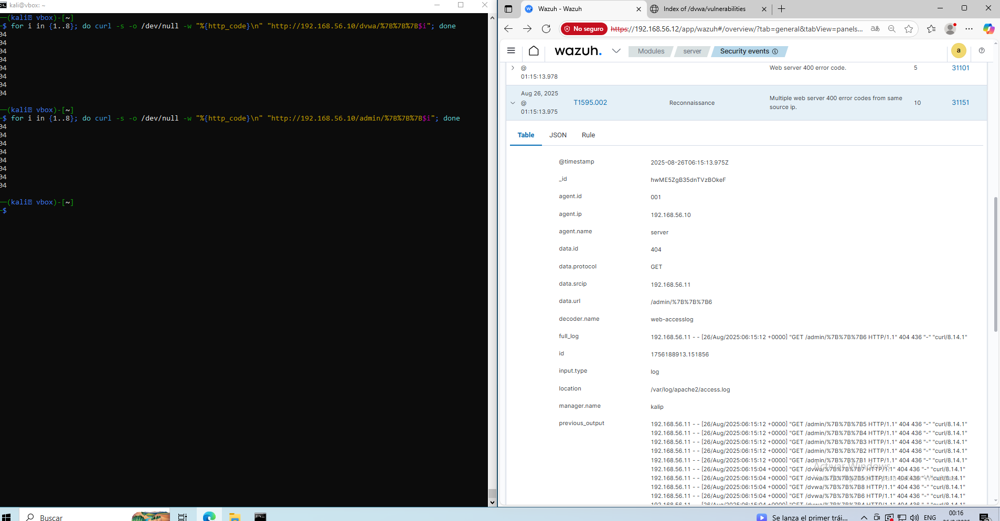

**Infraestructura:**
- Ubuntu Server (192.168.56.10) – Apache2 + DVWA  
- Kali Red (192.168.56.11) – atacante  
- Kali Purple (192.168.56.12) – Wazuh SIEM  
- Win10 (192.168.56.13) – endpoint corporativo  

---

## 🌐 Reconocimiento Web

Ataque con `curl` simulando fuzzing de directorios:

```bash
for i in {1..8}; do 
  curl -s -o /dev/null -w "%{http_code}\n" "http://192.168.56.10/admin/%7B%7B%7B$i"
done
```

***Fuente**: Apache access.log*

***Regla activada**: Multiple web server 400 error codes*

***Severidad**: 10*

***MITRE ATT&CK**: **T1595.002** – Active Scanning (Reconnaissance)*

***Regla de Wazuh***: Multiple web server 400/404 error codes.

 ***Resultado***: Wazuh marcó actividad sospechosa → Reconnaissance. 

### 🎯 Evidencia




