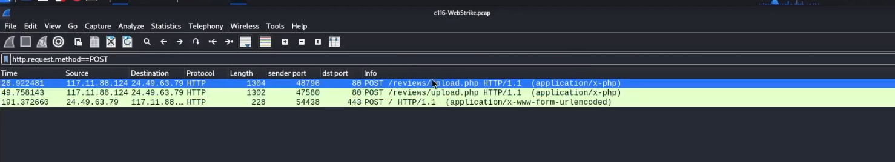

## 🗜️ Escenario
- Dataset: `c116-WebStrike.pcap` entregado por **CyberDefenders**.  
- Objetivo: Analizar tráfico de red y determinar vector de ataque, payloads y consecuencias.  

---

## 🕵️‍♂️ Hallazgos

- **IP atacante identificada** en Wireshark.  
- **Evidencia de webshell:** archivo malicioso `image.jpg.php` en `/reviews/uploads/`.  
- **Cronología reconstruida:** fuzzing → upload → ejecución.  
- **Nivel de dificultad:** *Fácil*.  

1. **Geolocalización del atacante**  
   - IP origen: `117.11.88.124`  
   - Ciudad: **Tianjin (China)**  
   - Uso: evidencia para **geo-blocking**.  

2. **User-Agent del atacante**  
   ```http
   Mozilla/5.0 (X11; Linux x86_64; rv:109.0) Gecko/20100101 Firefox/115.0
---

## 🧱MITRE ATT&CK Mapping

- **T1595 – Active Scanning**  
- **T1190 – Exploit Public-Facing Application**  
- **T1059 – Command Execution**  

---

## 🎯Evidencia



---


